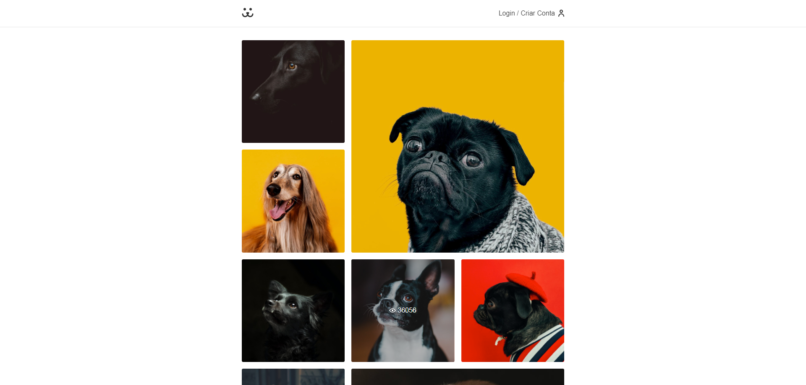

  

# 🐶 Social Dogs with Next.js (Em Desenvolvimento...)

Projeto de um aplicativo tipo rede-social, para cachorros, usando a API do curso Origamid para obter os dados.

- Veja o projeto: [Em Breve...]()

## 📝 Considerações

Upgrade do projeto, agora utilizando Typescript com Next.js
